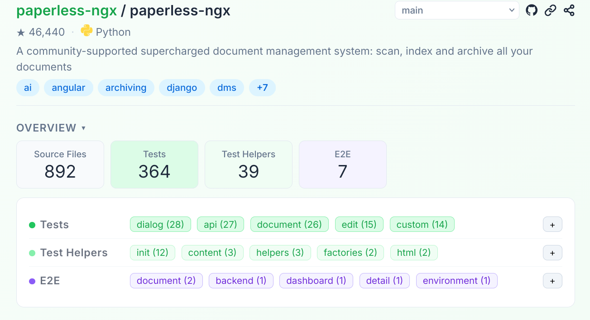
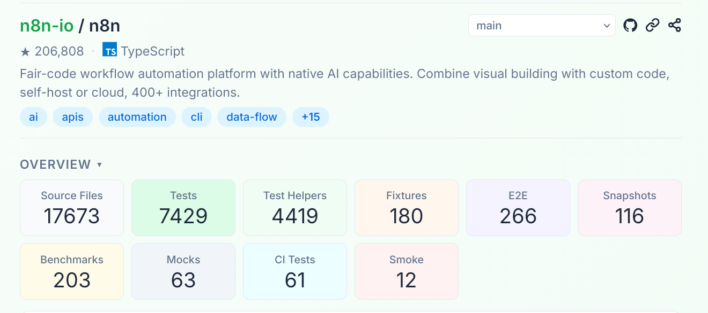

# Explorando Práticas de Teste

Neste exercício, vamos explorar práticas de teste em sistemas reais utilizando a ferramenta [TestMiner](https://andrehora.github.io/testminer).

O TestMiner permite visualizar e analisar testes de software em repositórios do GitHub, fornecendo dados sobre como os projetos organizam seus testes, como eles evoluem entre versões e quais bibliotecas de teste são utilizadas.
Explore a ferramenta antes de começar para se familiarizar com seu funcionamento.

Mais detalhes no GitHub da ferramenta: https://github.com/andrehora/testminer.

---

## Passo 1: Selecionar DOIS repositórios

Escolha dois repositórios reais que possuam testes de software.
Abaixo estão alguns links para ajudá-lo a encontrar projetos interessantes:

- Python: https://github.com/topics/python?l=python
- JavaScript: https://github.com/topics/javascript?l=javascript
- TypeScript: https://github.com/topics/typescript?l=typescript
- Java: https://github.com/topics/java?l=java

- Tópicos: [ai](https://andrehora.github.io/testminer/#topic:ai), [llm](https://andrehora.github.io/testminer/#topic:llm), [api](https://andrehora.github.io/testminer/#topic:api), [nodejs](https://andrehora.github.io/testminer/#topic:nodejs), [android](https://andrehora.github.io/testminer/#topic:android)

- Por organização: [Google](https://andrehora.github.io/testminer/#google), [Microsoft](https://andrehora.github.io/testminer/#microsoft), [Apple](https://andrehora.github.io/testminer/#apple), [Facebook](https://andrehora.github.io/testminer/#facebook), [Netflix](https://andrehora.github.io/testminer/#netflix), 
[GitHub](https://andrehora.github.io/testminer/#github), [Apache](https://andrehora.github.io/testminer/#apache), [HuggingFace](https://andrehora.github.io/testminer/#huggingface)

## Passo 2: Explorar os repositórios selecionados

Busque os repositórios escolhidos no [TestMiner](https://andrehora.github.io/testminer) e analise os dados de teste gerados pela ferramenta.

## Passo 3: Explicar as prática de teste

Para cada repositório, escolha uma prática ou dado de teste relevante e explique com suas próprias palavras.

---

## Instruções de entrega

1. Faça um `fork` deste repositório (saiba mais sobre forks [aqui](https://docs.github.com/pt/pull-requests/collaborating-with-pull-requests/working-with-forks/fork-a-repo)).
2. Responda às questões abaixo diretamente neste arquivo `README.md` do seu fork. Pode adicionar imagens para enriquecer sua explicação.
3. No Moodle, submeta apenas a URL do seu fork.

---

## Respostas

### Repositório 1 

Repositório: [https://github.com/paperless-ngx/paperless-ngx/](https://github.com/paperless-ngx/paperless-ngx/)

URL TestMiner: [https://andrehora.github.io/testminer/#paperless-ngx/paperless-ngx](https://andrehora.github.io/testminer/#paperless-ngx/paperless-ngx)

Explicação:
Observa-se pela overview do projeto que temos 364 testes, dos quais apenas 7 são testes e2e, a discrepância da quantidade índica claramente que o projeto valoriza testes fáceis e rápidos de validação, reservando testes trabalhosos somente para os caminhos críticos. Observando os arquivos dos 7 testes e2e, implementados usando Playwright, é perceptível que o projeto os útiliza para garantir o funcionamento das telas principais como dashboard e detalhes dos documentos.

### Repositório 2

Repositório: [https://github.com/n8n-io/n8n](https://github.com/n8n-io/n8n)

URL TestMiner: [https://andrehora.github.io/testminer/#n8n-io/n8n](https://andrehora.github.io/testminer/#n8n-io/n8n)

Explicação:
O n8n apresenta uma suíte de testes bem mais madura em relação ao projeto anterior. Podemos ver claramente a formação da pirâmide de testes ao analisar seus dados, onde temos na base 7.429 testes unitários ou de integração e 4.419 helpers; seguidos de 266 testes e2e e 12 testes smoke.
Observamos também a inclusão de 203 testes de benchmark índicando que a equipe se preocupa em garantir a não regressão do desempenho do sistema.

